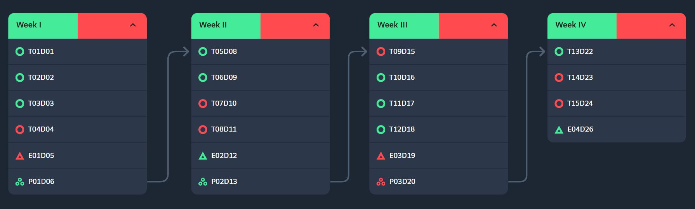
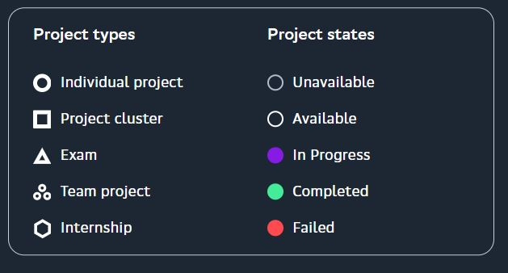
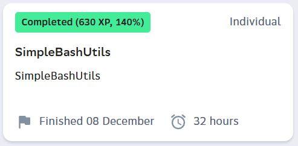
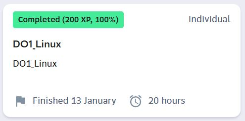
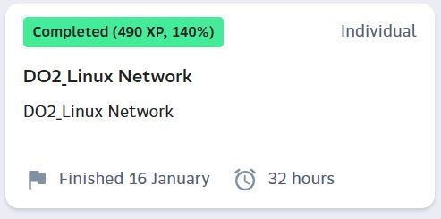

# my-school21-vault

This repository is intended to show my studies results at School 21. Completed (or not quite) projects are located in the "develop" folders.

## Survival camp result

### Projects map 

### Projects map legend

## Core program result

