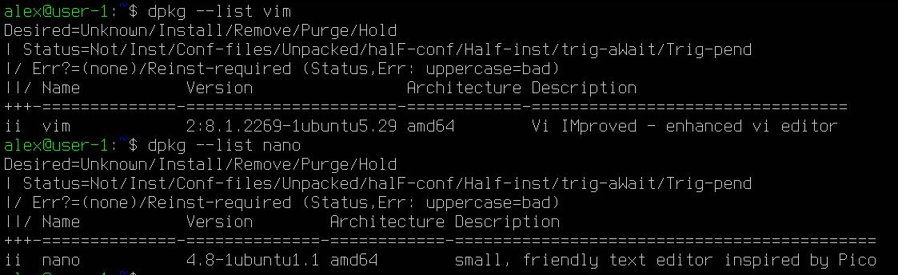
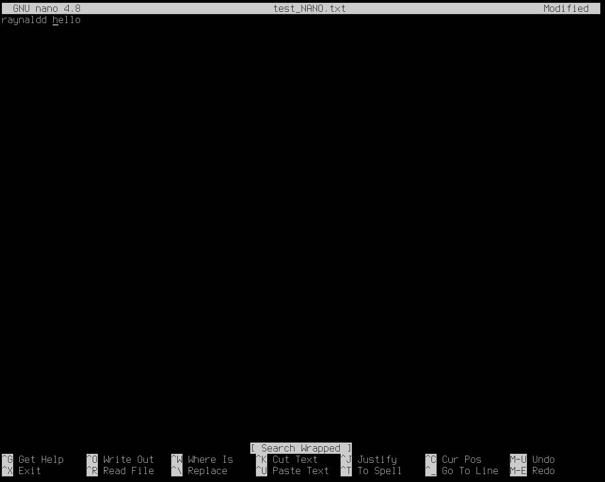

## Part 1. Установка ОС
Узнай версию Ubuntu, выполнив команду `cat /etc/issue`.

## Part 2. Создание пользователя
Вставь скриншот вызова команды для создания пользователя. Пользователь должен быть добавлен в группу `adm`.

Вывод групп пользователя `newuser`.

Новый пользователь должен быть в выводе команды `cat /etc/passwd`.

## Part 3. Настройка сети ОС
### 1. Задай название машины вида user-1.
Открываю файл `/etc/hostname` в текстовом редакторе `VIM`.

Изменяю строку `ubuntu-server-20-04` на `user-1`.  Сохраняю файл.

Используя команду `reboot`, перезагружаю машину и проверяю `hostname`.

### 2. Установи временную зону, соответствующую твоему текущему местоположению.

### 3. Выведи названия сетевых интерфейсов с помощью консольной команды.

lo (loopback device) – виртуальный интерфейс, присутствующий по умолчанию в любом Linux. Он используется для отладки сетевых программ и запуска серверных приложений на локальной машине. С этим интерфейсом всегда связан адрес 127.0.0.1. У него есть dns-имя – localhost.
### 4. Используя консольную команду получить ip адрес устройства, на котором ты работаешь, от DHCP-сервера.

DHCP (Dynamic Host Configuration Protocol) - сетевой протокол, позволяющий сетевым устройствам автоматически получать IP-адрес и другие параметры, необходимые для работы в сети. Данный протокол работает по модели «клиент-сервер».
### 5. Определи и выведи на экран внешний ip-адрес шлюза (ip) и внутренний IP-адрес шлюза, он же ip-адрес по умолчанию (gw).
Внешний ip-адрес шлюза (ip).

 

Внутренний ip-адрес шлюза (gw).

### 6. Задай статичные (заданные вручную, а не полученные от DHCP-сервера) настройки ip, gw, dns (используй публичный DNS-серверы, например 1.1.1.1 или 8.8.8.8).
Открываю файл конфигурации `Netplan` в текстовом редакторе `VIM`.

Отключаю DHCP, прописываю вручную ip, gw и dns.

После внесения изменений в файл конфигурации применяю их.

### 7. Перезагрузи виртуальную машину. Убедись, что статичные сетевые настройки (ip, gw, dns) соответствуют заданным в предыдущем пункте.
Используя команду `reboot`, перезагружаю машину и проверяю настройки ip, gw

и настройки dns.

Успешно пропингуй удаленные хосты 1.1.1.1 и ya.ru и вставь в отчёт скрин с выводом команды. В выводе команды должна быть фраза «0% packet loss».

## Part 4. Обновление ОС
### Обнови системные пакеты до последней на момент выполнения задания версии.
Обновляю локальную базу данных доступных пакетов.

Обновляю установленные пакеты.

Повторно обновляю локальную базу данных доступных пакетов.

## Part 5. Использование команды sudo
Разрешить пользователю, созданному в Part 2, выполнять команду sudo.

sudo (substitute user and do) - это утилита UNIX-систем, позволяющая пользователю запускать программы с привилегиями другой учётной записи, как правило, суперпользователя.

Поменяй hostname ОС от имени пользователя, созданного в [Part 2](#part-2-создание-пользователя) (используя sudo).

## Part 6. Установка и настройка службы времени
### Настрой службу автоматической синхронизации времени.
Вывод следующей команды должен содержать `NTPSynchronized=yes: timedatectl show`

## Part 7. Установка и использование текстовых редакторов
### 1. Установи текстовые редакторы VIM (+ любые два по желанию NANO, MCEDIT, JOE и т. д.)
`VIM` и `NANO` уже установлены

Установка `MCEDIT`

Проверка версии `MCEDIT`

### 2. Используя каждый из трех выбранных редакторов, создайте файл test_X.txt, где X -- название редактора, в котором создан файл. Напишите в нём свой никнейм, закройте файл с сохранением изменений.
`vim test_VIM.txt`
Выход с сохранением изменений: ESC, :wq

`nano test_NANO.txt`
Выход с сохранением изменений:  CTRL+O, ENTER, CTRL+X

`mcedit test_MCEDIT.txt`
Выход с сохранением изменений: F2, ENTER, F10

### 3. Используя каждый из трех выбранных редакторов, откройте файл на редактирование, отредактируйте файл, заменив никнейм на строку "21 School 21", закройте файл без сохранения изменений.
`vim test_VIM.txt`
Выход без сохранения изменений: ESC, :q!

`nano test_NANO.txt`
Выход без сохранения изменений: CTRL+X, N

`mcedit test_MCEDIT.txt`
Выход без сохранения изменений: F10, <-(No), ENTER

### 4. Используя каждый из трех выбранных редакторов, отредактируйте файл ещё раз (по аналогии с предыдущим пунктом), а затем освойте функции поиска по содержимому файла (слово) и замены слова на любое другое.

`vim test_VIM.txt`
Поиск первой найденной подстроки `hello` в файле: `/hello`, ENTER

Замена первой найденной подстроки `hello` в строке на подстроку `bye`: `:s/hello/bye`, ENTER

Замена всех подстрок `hello` в строке на подстроку `bye`: `:s/hello/bye/g`, ENTER
Замена всех подстрок `hello` на подстроку `bye` в файле: `:%s/hello/bye/g`, ENTER

`nano test_NANO.txt`
Поиск первой найденной подстроки `hello` в файле: CTRL+W, `hello`, ENTER

Замена выбранной подстроки `hello` в файле на подстроку `bye`:  CTRL+\\, `hello`, ENTER, `bye`, ENTER, Y/N

`mcedit test_MCEDIT.txt`
Поиск  первой найденной подстроки `hello` в файле (остальные строки выделяет): F7, `hello`, Find all

Замена выбранной подстроки `hello` в файле на подстроку `bye`:  F4, `hello`,  `bye`, Replace/Skip/All

## Part 8. Установка и базовая настройка сервиса SSHD
### 1. Установи службу SSHd.

### 2. Добавь автостарт службы при загрузке системы.

### 3. Перенастрой службу SSHd на порт 2022.

Перезапуск службы SSHd.

Статус службы SSHd.

### 4. Используя команду ps, покажи наличие процесса sshd. Для этого к команде нужно подобрать ключи.

- **`ps`**: Это команда для отображения текущих процессов в системе. Она предоставляет информацию о запущенных процессах, включая их идентификаторы и состояние.
- **`aux`**: Это комбинация ключей, которая расширяет вывод команды `ps`.
    - **`a`**: Этот ключ указывает на отображение всех процессов, запущенных в системе, включая процессы других пользователей, а не только те, которые принадлежат текущему пользователю. Он также включает процессы, не привязанные к терминалу.
    - **`u`**: Этот ключ добавляет информацию о пользователе, который запустил процесс. Вывод включает имя пользователя и дополнительные данные о процессе, такие как использование CPU и памяти.
    - **`x`**: Этот ключ указывает на отображение процессов, которые не имеют привязки к терминалу (фоновый режим). Это полезно для получения информации о системных процессах и демонах.

### 5. Перезагрузи систему.
Вывод команды netstat -tan должен содержать  
`tcp 0 0 0.0.0.0:2022 0.0.0.0:* LISTEN`
(если команды netstat нет, то ее нужно установить).
С помощью команды `reboot` перезагружаю систему и устанавливаю пакет `net-tools`

Объяснение ключей `-tan`

- **`-t`**: Этот ключ указывает команде `netstat` выводить только TCP-соединения. 
- **`-a`**: Этот ключ показывает все активные соединения и порты, которые находятся в состоянии прослушивания (LISTEN).
- **`-n`**: Этот ключ выводит адреса и номера портов в числовом формате.

Объяснение каждого столбца

- **Proto**: Протокол, используемый для соединения (например, TCP или UDP).
- **Recv-Q**: Количество байтов в очереди на получение (Receive Queue). Это количество данных, ожидающих обработки на стороне приложения.
- **Send-Q**: Количество байтов в очереди на отправку (Send Queue). Это количество данных, ожидающих отправки по сети.
- **Local Address**: Локальный адрес и порт, на котором процесс слушает. В данном случае `0.0.0.0:2022` означает, что процесс слушает на всех доступных интерфейсах на порту 2022.
- **Foreign Address**: Удаленный адрес и порт, с которыми установлено соединение. В случае состояния LISTEN удаленный адрес обозначается как `0.0.0.0:*`, что означает, что процесс готов принимать соединения от любых удаленных адресов.
- **State**: Состояние соединения. В данном случае состояние `LISTEN` указывает на то, что процесс ожидает входящих подключений.

## Part 9. Установка и использование утилит top, htop
### Установи и запусти утилиты top и htop.

- По выводу команды top определи и напиши в отчёте:
  - uptime: 53 минуты - время, прошедшее с момента последней загрузки системы;
  - количество авторизованных пользователей: 1 пользователь;
  - среднюю загрузку системы (за 1, 5 и 15 минут): 0.00, 0.00, 0.00;
  - общее количество процессов: 105;
  - загрузку CPU: 0.2 sy - процент времени, в течение которого CPU выполняет системные процессы, 99.8 id - процент времени, в течение которого CPU не занят выполнением каких-либо процессов;
  - загрузку памяти: 

	**MiB Mem** отображает использование физической оперативной памяти (RAM) в мебибайтах (MiB).
	**MiB Swap** отображает использование пространства подкачки (swap space), также в мебибайтах.
  - pid процесса занимающего больше всего памяти: 690;

  - pid процесса, занимающего больше всего процессорного времени: 1765;

- В отчёт вставь скрин с выводом команды htop:
  - отсортированному по PID

 

  PERCENT_CPU

  

  PERCENT_MEM

 

  TIME

  

  - отфильтрованному для процесса sshd

  

  - с процессом syslog, найденным, используя поиск

  

  - с добавленным выводом hostname, clock и uptime

  

## Part 10. Использование утилиты fdisk
### Запусти команду fdisk -l.

 

Название жесткого диска: /dev/sda
Размер диска: 16 GiB
Количество секторов: 33554432
Так как swap настроен как файл, а не как отдельный раздел, утилита `fdisk` его не отображает.

 

Размер swap: 1.9G

## Part 11. Использование утилиты df

 

- Для корневого раздела (/):
    - размер раздела: 10218772
    - размер занятого пространства: 5003744
    - размер свободного пространства: 4674356
    - процент использования: 52
- Единица измерения в выводе: килобайты

 

- Для корневого раздела (/):
    - размер раздела: 9.8G
    - размер занятого пространства: 4.8G
    - размер свободного пространства: 4.5G
    - процент использования: 52
- Тип файловой системы раздела: ext4

## Part 12. Использование утилиты du
### Запусти команду du.
Выведи размер папок /home, /var, /var/log (в байтах, в человекочитаемом виде).

 

Выведи размер всего содержимого в /var/log (не общее, а каждого вложенного элемента, используя *).

 

## Part 13. Установка и использование утилиты ncdu
### Установи утилиту ncdu.

 

### Выведи размер папок /home, /var, /var/log.
`ncdu /home`

 

`sudo ncdu /var`

 

`sudo ncdu /var/log`

 

## Part 14. Работа с системными журналами
### Открой для просмотра:
1. /var/log/dmesg

 

2. /var/log/syslog

 

3. /var/log/auth.log

 

Время последней успешной авторизации: Jan 13 16:30:12
Имя польователя: alex
Метод входа в систему: sudo

 

Перезапусти службу SSHd.

 

## Part 15. Использование планировщика заданий CRON
### Используя планировщик заданий, запусти команду uptime через каждые 2 минуты.

 

### Удали все задания из планировщика заданий.

 
