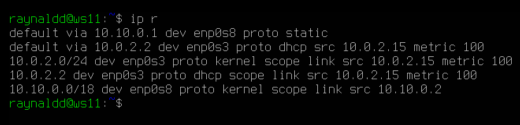
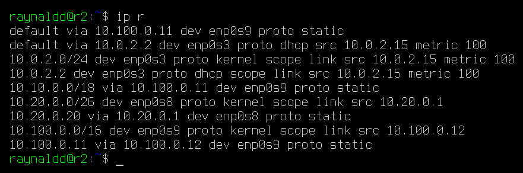
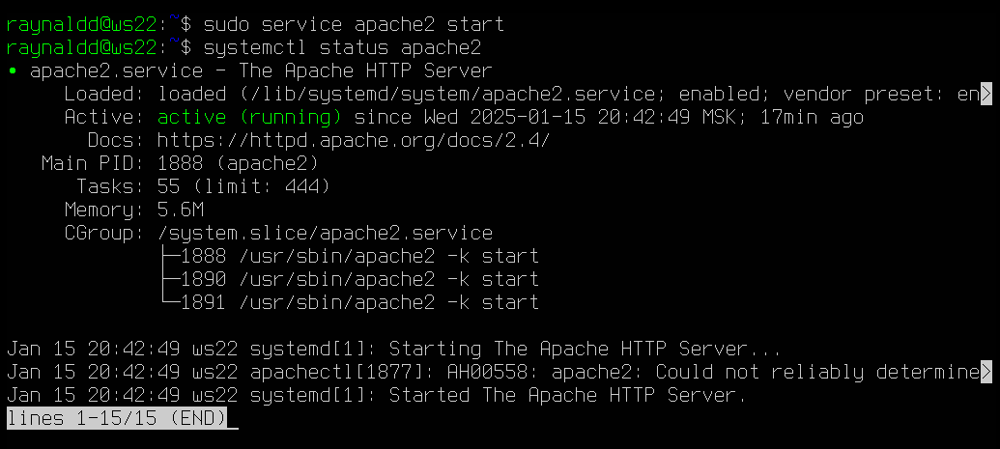
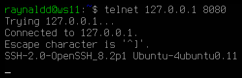

## Part 1. Инструмент **ipcalc**
##### Подними виртуальную машину (далее -- ws1).
Клонирую виртуальную машину с установленной и настроенной Ubuntu Server 20.04 LTS из прошлого проекта. Остальные виртуальные машины также буду создавать при помощи операции клонирования с генерацией новых MAC-адресов всех сетевых адаптеров.

Установка `ipcalc`

#### 1.1. Сети и маски
##### Определи и запиши в отчёт:
##### 1) Адрес сети *192.167.38.54/13*
Адрес сети: 192.160.0.0

##### 2) Перевод маски *255.255.255.0* в префиксную и двоичную запись, */15* в обычную и двоичную, *11111111.11111111.11111111.11110000* в обычную и префиксную
255.255.255.0 в префиксной записи: /24 
255.255.255.0 в двоичной записи: 11111111.11111111.11111111.00000000

/15 в обычной записи: 255.254.0.0  
/15 в двоичной записи: 11111111.11111110.00000000.00000000

11111111.11111111.11111111.11110000 в обычной записи: 255.255.255.240`  
11111111.11111111.11111111.11110000 в префиксной записи: /28

##### 3) Минимальный и максимальный хост в сети *12.167.38.4* при масках: */8*, *11111111.11111111.00000000.00000000*, *255.255.254.0* и */4*

#### 1.2. localhost
##### Определи и запиши в отчёт, можно ли обратиться к приложению, работающему на localhost, со следующими IP: *194.34.23.100*, *127.0.0.2*, *127.1.0.1*, *128.0.0.1*
- 194.34.23.100 - нельзя
- 127.0.0.2 - можно
- 127.1.0.1 - можно
- 128.0.0.1 - нельзя

#### 1.3. Диапазоны и сегменты сетей
##### Определи и запиши в отчёт:
##### 1) Какие из перечисленных IP можно использовать в качестве публичного, а какие только в качестве частных: *10.0.0.45*, *134.43.0.2*, *192.168.4.2*, *172.20.250.4*, *172.0.2.1*, *192.172.0.1*, *172.68.0.2*, *172.16.255.255*, *10.10.10.10*, *192.169.168.1*
- 10.0.0.45 - частный
- 134.43.0.2 - публичный
- 192.168.4.2 - частный
- 172.20.250.4 - частный
- 172.0.2.1 - публичный
- 192.172.0.1 - публичный
- 172.68.0.2 - публичный
- 172.16.255.255 - частный
- 10.10.10.10 - частный
- 192.169.168.1 - публичный

##### 2) Какие из перечисленных IP-адресов шлюза возможны у сети *10.10.0.0/18*: *10.0.0.1*, *10.10.0.2*, *10.10.10.10*, *10.10.100.1*, *10.10.1.255*
- 10.0.0.1 - невозможен
- 10.10.0.2 - возможен
- 10.10.10.10 - возможен
- 10.10.100.1 - невозможен
- 10.10.1.255 - возможен

## Part 2. Статическая маршрутизация между двумя машинами
##### Подними две виртуальные машины (далее -- ws1 и ws2).
##### С помощью команды `ip a` посмотри существующие сетевые интерфейсы.
ws1

ws2

##### Опиши сетевой интерфейс, соответствующий внутренней сети, на обеих машинах и задай следующие адреса и маски: ws1 — *192.168.100.10*, маска */16*, ws2 — *172.24.116.8*, маска */12*.
ws1

ws2

##### Выполни команду `netplan apply` для перезапуска сервиса сети.
ws1

ws2

#### 2.1. Добавление статического маршрута вручную
##### Добавь статический маршрут от одной машины до другой и обратно при помощи команды вида `ip r add`.
ws1

ws2

##### Пропингуй соединение между машинами.

ws1

ws2

#### 2.2. Добавление статического маршрута с сохранением
##### Перезапусти машины.

`reboot`

##### Добавь статический маршрут от одной машины до другой с помощью файла */etc/netplan/00-installer-config.yaml*.

ws1

Применяю изменения: `sudo netplan apply`

ws2

Применяю изменения: `sudo netplan apply`

##### Пропингуй соединение между машинами.

ws1

ws2

## Part 3. Утилита **iperf3**

#### 3.1. Скорость соединения
##### Переведи и запиши в отчёт: 8 Mbps в MB/s, 100 MB/s в Kbps, 1 Gbps в Mbps.
- 8 Mbps (мегабит/c) = 1 MB/s (мегабайт/c): 
8 / 8 = 1
- 100 MB/s (мегабайт/c) = 819200 Kbps (килобит/c): 
100 * 1024 \* 8 = 819200
- 1 Gbps (гигабит/c) = 1024 Mbps (мегабит/c): 
1 * 1024 = 1024
#### 3.2. Утилита **iperf3**
##### Измерь скорость соединения между ws1 и ws2.
Установка `iperf3` на ws1 (на ws2 аналогично)

ws1

ws2

## Part 4. Сетевой экран

#### 4.1. Утилита **iptables**
##### Создай файл */etc/firewall.sh*, имитирующий файрвол, на ws1 и ws2.

Создаю файл `/etc/firewall.sh` на ws1

и ws2.

##### Нужно добавить в файл подряд следующие правила:
##### 1) На ws1 примени стратегию, когда в начале пишется запрещающее правило, а в конце пишется разрешающее правило (это касается пунктов 4 и 5).
##### 2) На ws2 примени стратегию, когда в начале пишется разрешающее правило, а в конце пишется запрещающее правило (это касается пунктов 4 и 5).
##### 3) Открой на машинах доступ для порта 22 (ssh) и порта 80 (http).
##### 4) Запрети *echo reply* (машина не должна «пинговаться», т. е. должна быть блокировка на OUTPUT).
##### 5) Разреши *echo reply* (машина должна «пинговаться»).

На ws1 `sudo vim /etc/firewall.sh`

На ws2 `sudo vim /etc/firewall.sh`

##### Запусти файлы на обеих машинах командами `chmod +x /etc/firewall.sh` и `/etc/firewall.sh`.

ws1

ws2

Утилита `iptables` обрабатывает правила в цепочке сверху вниз. Соответсвенно на ws1 будет выполняться запрещающее правило (DROP) и машина не будет «пинговаться», а на ws2 наоборот, первым стоит разрешающее правило (ACCEPT) и машина будет «пинговаться».

#### 4.2. Утилита **nmap**
##### Командой **ping** найди машину, которая не «пингуется», после чего утилитой **nmap** покажи, что хост машины запущен.

Установка утилиты `nmap` на ws2 (на ws1 аналогично)

ws1 не пингуется, хотя хост машины запущен

##### Сохрани дампы образов виртуальных машин

## Part 5. Статическая маршрутизация сети

##### Подними пять виртуальных машин (3 рабочие станции (ws11, ws21, ws22) и 2 роутера (r1, r2)).

#### 5.1. Настройка адресов машин
##### Настрой конфигурации машин в *etc/netplan/00-installer-config.yaml* согласно сети на рисунке.
ws11

ws21

ws22

r1

r2

##### Перезапусти сервис сети. Если ошибок нет, командой `ip -4 a` проверь, что адрес машины задан верно. Также пропингуй ws22 с ws21. Аналогично пропингуй r1 с ws11.

ws11

ws21

ws22

r1

r2

#### 5.2. Включение переадресации IP-адресов
##### Для включения переадресации IP выполни команду на роутерах:
`sysctl -w net.ipv4.ip_forward=1`

r1

r1

##### Открой файл */etc/sysctl.conf* и добавь в него следующую строку:
`net.ipv4.ip_forward = 1`

на r1 и r2: sudo `vim /etc/sysctl.conf`

#### 5.3. Установка маршрута по умолчанию

##### Настрой маршрут по умолчанию (шлюз) для рабочих станций. Для этого добавь `default` перед IP-роутера в файле конфигураций.

ws11

ws21

ws22

##### Вызови `ip r` и покажи, что добавился маршрут в таблицу маршрутизации.

ws11

ws21

ws22

##### Пропингуй с ws11 роутер r2 и покажи на r2, что пинг доходит. Для этого используй команду:
`tcpdump -tn -i eth0`

ws11

r2

#### 5.4. Добавление статических маршрутов
##### Добавь в роутеры r1 и r2 статические маршруты в файле конфигураций. Пример для r1 маршрута в сетку 10.20.0.0/26:

r1

r2

##### Вызови `ip r` и покажи таблицы с маршрутами на обоих роутерах. Пример таблицы на r1:

r1

r2

##### Запусти команды на ws11:
`ip r list 10.10.0.0/[маска сети]` и `ip r list 0.0.0.0/0`

Маршрут был выбран отличный, поскольку процесс оценки маршрута в каждом маршрутизаторе использует метод совпадения самого длинного префикса для получения наиболее точного маршрута. Сеть с самой длинной маской подсети или префиксом сети, которая соответсвует целевому ip-адресу, является сетевым шлюзом следующего перехода. Процесс повторяется до тех пор, пока пакет не будет доставлен на хост назначения. Если вкратце, при наличии двух и более маршрутов выбирается маршрут с самой длинной маской т.к. он более точный.

#### 5.5. Построение списка маршрутизаторов

##### Запусти на r1 команду дампа:
`tcpdump -tnv -i eth0`

Вызов команды `tcpdump -tnv -i enp0s8`

##### При помощи утилиты **traceroute** построй список маршрутизаторов на пути от ws11 до ws21.

Установка утилиты `traceroute`

Вызов утилиты `traceroute`

Вывод команды `tcpdump -tnv -i enp0s8`

Каждый пакет проходит на своем пути определенное количество узлов, пока достигнет своей цели. Причем, каждый пакет имеет свое время жизни. Это количество узлов, которые может пройти пакет перед тем, как он будет уничтожен. Этот параметр записывается в заголовке TTL, каждый маршрутизатор, через который будет проходить пакет уменьшает его на единицу. При TTL=0 пакет уничтожается, а отправителю отсылается сообщение Time Exceeded.Команда traceroute linux использует UDP пакеты. Она отправляет пакет с TTL=1 и смотрит адрес ответившего узла, дальше TTL=2, TTL=3 и так пока не достигнет цели. Каждый раз отправляется по три пакета и для каждого из них измеряется время прохождения. Пакет отправляется на случайный порт, который, скорее всего, не занят. Когда утилита traceroute получает сообщение от целевого узла о том, что порт недоступен трассировка считается завершенной

#### 5.6. Использование протокола **ICMP** при маршрутизации
##### Запусти на r1 перехват сетевого трафика, проходящего через eth0 с помощью команды:
`tcpdump -n -i eth0 icmp`

Вызов и вывод команды `tcpdump -n -i enp0s8 icmp` в результате пинга с ws11

##### Пропингуй с ws11 несуществующий IP (например, *10.30.0.111*) с помощью команды:
`ping -c 1 10.30.0.111`

Вызов и вывод команды `ping -c 1 10.30.0.111`

##### Сохрани дампы образов виртуальных машин.

## Part 6. Динамическая настройка IP с помощью **DHCP**

##### Для r2 настрой в файле */etc/dhcp/dhcpd.conf* конфигурацию службы **DHCP**:
##### 1) Укажи адрес маршрутизатора по умолчанию, DNS-сервер и адрес внутренней сети.

Установка DHCP на r2 (на r1 аналогично)

Настройка конфигурации DHCP: 
`sudo vim /etc/dhcp/dhcpd.conf`

##### 2) В файле *resolv.conf* пропиши `nameserver 8.8.8.8`.
`sudo vim /etc/resolv.conf`

##### Перезагрузи службу **DHCP** командой `systemctl restart isc-dhcp-server`. 

Машину ws21 перезагрузи при помощи `reboot` и через `ip a` покажи, что она получила адрес. 

Также пропингуй ws22 с ws21.

##### Укажи MAC-адрес у ws11, для этого в *etc/netplan/00-installer-config.yaml* надо добавить строки: `macaddress: 10:10:10:10:10:BA`, `dhcp4: true`.

##### Для r1 настрой аналогично r2, но сделай выдачу адресов с жесткой привязкой к MAC-адресу (ws11). Проведи аналогичные тесты.

Настройка конфигурации DHCP: 
`sudo vim /etc/dhcp/dhcpd.conf`

`sudo vim /etc/resolv.conf`

`sudo systemctl restart isc-dhcp-server`

Проверка присвоения ipv4 хосту ws11 через DHCP по MAC-адресу + ping r1

##### Запроси с ws21 обновление IP-адреса.

До обновления IP-адреса

Освобождение текущего IP-адреса:
`sudo dhclient -r enp0s8`

Запрос нового IP-адреса:
`sudo dhclient enp0s8`

После обновления IP-адреса

##### Сохрани дампы образов виртуальных машин.

## Part 7. **NAT**

##### В файле */etc/apache2/ports.conf* на ws22 и r1 измени строку `Listen 80` на `Listen 0.0.0.0:80`, то есть сделай сервер Apache2 общедоступным.

Устанавливаю на ws22 и r1 `apache2` с помощью команды:
`sudo apt install apache2`

Измененный файл `/etc/apache2/ports.conf` на ws22 и r1

##### Запусти веб-сервер Apache командой `service apache2 start` на ws22 и r1.

r1

ws22

##### Добавь в фаервол, созданный по аналогии с фаерволом из Части 4, на r2 следующие правила:
##### 1) Удаление правил в таблице filter — `iptables -F`;
##### 2) Удаление правил в таблице «NAT» — `iptables -F -t nat`;
##### 3) Отбрасывать все маршрутизируемые пакеты — `iptables --policy FORWARD DROP`.

Редактирую `firewall.sh` на r2: `sudo vim /etc/firewall.sh`

##### Запусти файл также, как в Части 4.

`sudo /etc/firewall.sh`

##### Проверь соединение между ws22 и r1 командой `ping`.

##### Добавь в файл ещё одно правило:
##### 4) Разрешить маршрутизацию всех пакетов протокола **ICMP**.

##### Запусти файл также, как в Части 4.

`sudo /etc/firewall.sh`

##### Проверь соединение между ws22 и r1 командой `ping`.

##### Добавь в файл ещё два правила:
##### 5) Включи **SNAT**, а именно маскирование всех локальных IPиз локальной сети, находящейся за r2 (по обозначениям из Части 5 — сеть 10.20.0.0).

##### 6) Включи **DNAT** на 8080 порт машины r2 и добавить к веб-серверу Apache, запущенному на ws22, доступ извне сети.

Настройка SNAT и DNAT + разрешение на пересылку TCP-пакетов

##### Запусти файл также, как в Части 4.

`sudo /etc/firewall.sh`

##### Проверь соединение по TCP для **SNAT**: для этого с ws22 подключиться к серверу Apache на r1 командой:

`telnet [адрес] [порт]`

##### Проверь соединение по TCP для **DNAT**: для этого с r1 подключиться к серверу Apache на ws22 командой `telnet` (обращаться по адресу r2 и порту 8080).

##### Сохрани дампы образов виртуальных машин.

## Part 8. Дополнительно. Знакомство с **SSH Tunnels**
##### Запусти на r2 фаервол с правилами из Части 7.

`sudo /etc/firewall.sh`

##### Запусти веб-сервер **Apache** на ws22 только на localhost (то есть в файле */etc/apache2/ports.conf* измени строку `Listen 80` на `Listen localhost:80`).

Редактирую файл `/etc/apache2/ports.conf`

Перезапускаю `apache2`

##### Воспользуйся *Local TCP forwarding* с ws21 до ws22, чтобы получить доступ к веб-серверу на ws22 с ws21.

##### Воспользуйся *Remote TCP forwarding* c ws11 до ws22, чтобы получить доступ к веб-серверу на ws22 с ws11.

##### Для проверки, сработало ли подключение в обоих предыдущих пунктах, перейди во второй терминал (например, клавишами Alt + F2) и выполни команду:
`telnet 127.0.0.1 [локальный порт]`

##### Сохрани дампы образов виртуальных машин.

